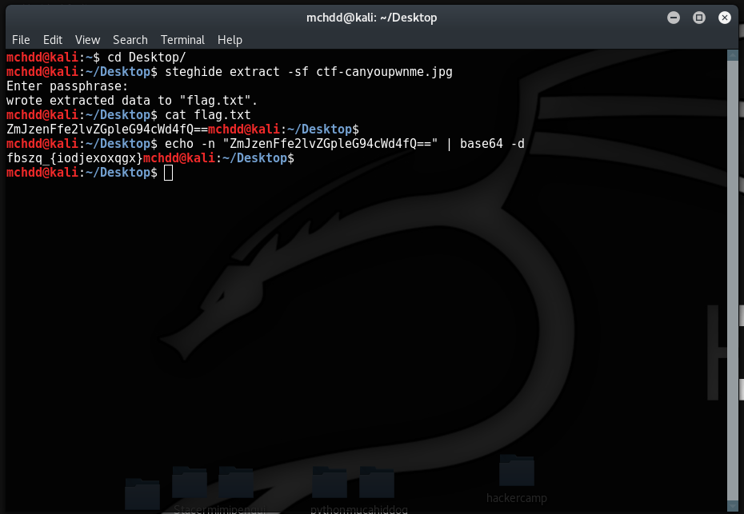
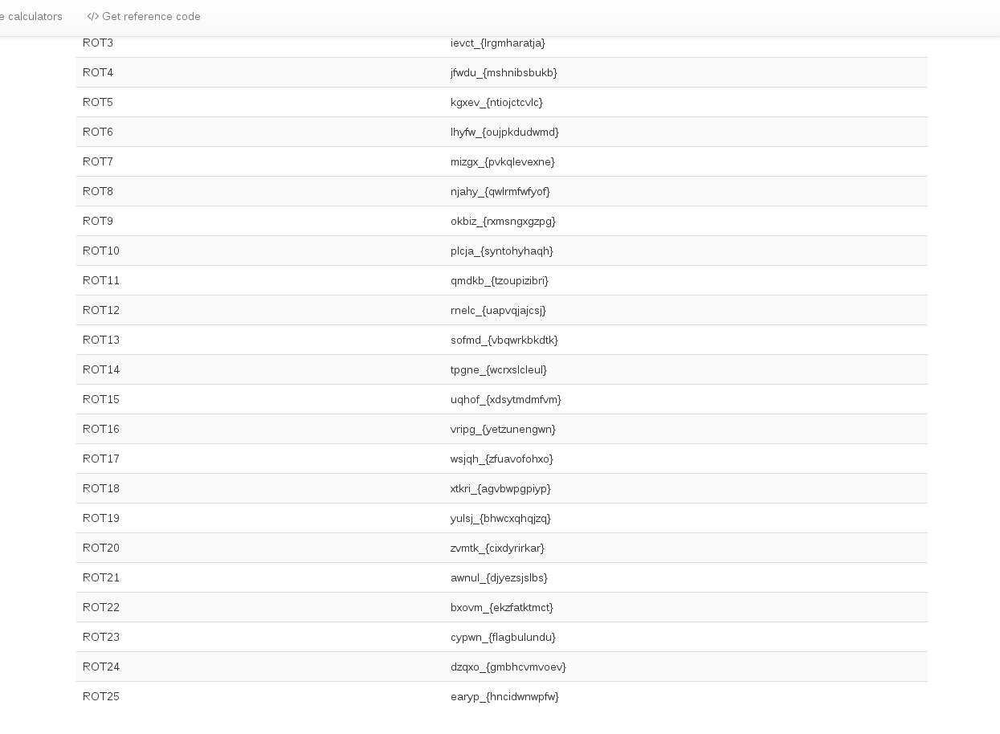

The Secret of The Photo

Soruda Canyoupwn me logosuna stenografi kullanarak gizlenmiş şifreli metni bulmamızı istiyor.


bu fotoğraftaki metine terminalden steghide sayesine ulaşılabilir.
Steghide indirmek için:
```
apt-get install steghide
```



Bu komutlar ile Fotoğrafta gizlenen metni Steghide ile ortaya "flag.txt" çıktı.
 daha sonra flagdan çıkan kod sonundaki = işaretinden base64 e benziyor gibi ve yine terminal
 üzerinden base64 olan metni normal haline

 ```
 echo -n "metinnnnn" | base64 -d
 ```

komutu ile çevrilebilir.
çıkan sonuç ise Sezar şifreleme ile oluşturulmuş. Sezar şifreleme rotları ise kod yazılmazsa online
olarak çevrilebilir.
örnek site: 
[PlanetCalc](https://planetcalc.com/1434/)



bu fotoğrafta Sezar şifrelemenin tüm rotlarda denendiği ve sonucun '''cypwn_{flagbulundu}'''
olarak rot23 te karşımıza çıkıyor.

```
flag: cypwn_{flagbulundu}
```
