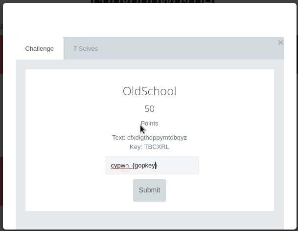
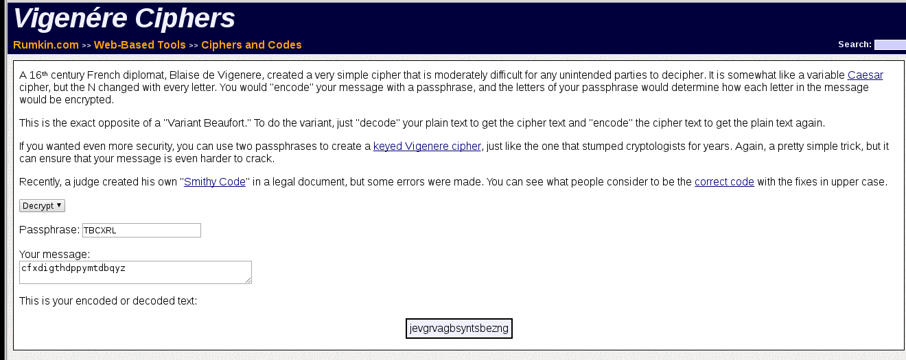
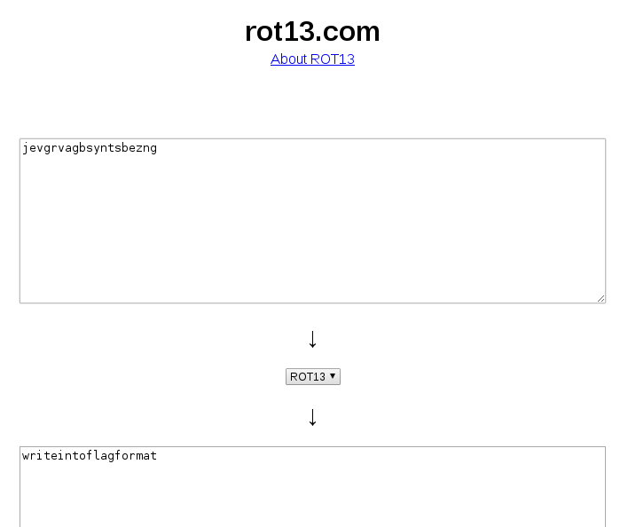

# Crypto50

# OldSchool



Bu soruda ise 2 tane karışık harflerden oluşan string verilmiş.
Soruda Keyi kullanarak Text i çözümlememiz isteniyor bu verilerle şifrenin Vigenere şifreleme
ile oluşturulduğu belli oluyor.

Vigenere Cipher linki: [Vigenere](http://rumkin.com/tools/cipher/vigenere.php)



Ardından ise ortaya çıkan metin "jevgrvagbsyntsbezng" yeni bir şifreleme yöntemi ile çözülmesi gerekiyor.
Çoğu yöntemleri denedikten sonra Bunun Ceaser şifrelemenin en bilineni ROT13 ile şifrelendiği ortaya çıkıyor.

ROT13 Linki: [ROT13](http://www.rot13.com/)



Flag:

```
cypwn_{writeintoflagformat}
```
