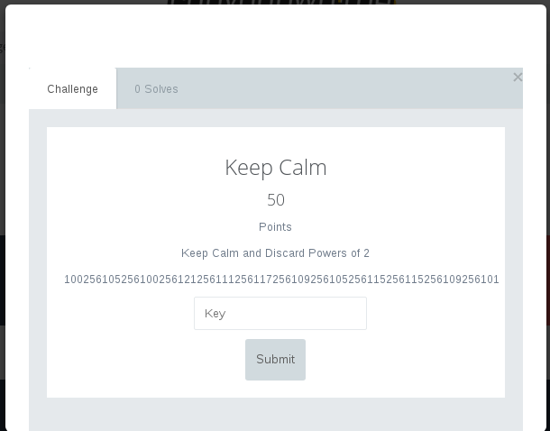
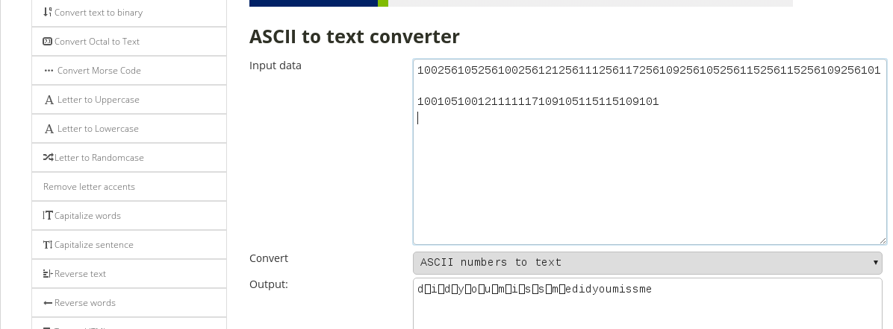

# Crypto50

# Keep Calm



Soruda sadece sayılardan oluşan şifreli bir metin var ve sayıların arasında tekrarlayan 256 olduğu belli oluyor.
Converterlarda tek tek deneyince ASCII to text converter da flag ortaya çıkıyordu.



Flag:

```
cypwn_{didyoumissme}
```