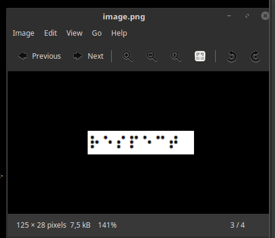
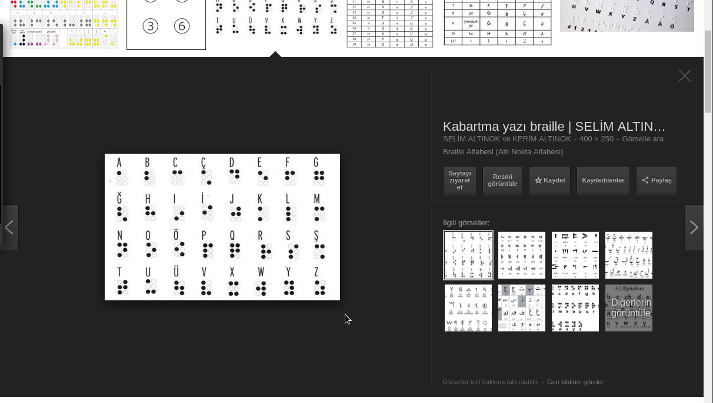

# Decode25



Bu fotoğrafta bazı karakterler ile oluşturulmuş mesajı ortaya çıkarmamız lazım.
Bunun için Alfabeleri araştırdığımızda Braille alfabesi yani kabartma yazı ile uyuştuğu ortaya çıkıyor.



Karakterleri karşılaştırınca flag "respect" şeklinde ortaya çıkıyor.
Flag:

```
cypwn_{respect}
```
