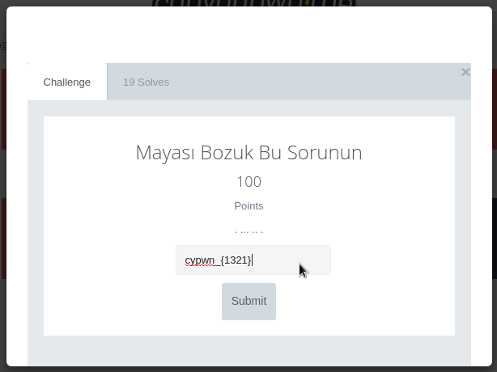

# Trivia100

# Mayası Bozuk Bu sorunun
```
. ... .. .
```



Sorunun içerisine ipucu bırakılmıştı "MAYA"
Yani soru maya alfabesi ile oluşturulmuştu. Geriye sadece maya alfabesinin karakterlerini
bulmak kalıyor. Tabi anlaması bu kadar kolay olmamıştı :)

Aslında soruyu çözerken sadece noktaların sayı karşılığını (1321) yazmıştım ve şans eseri ortaya çıkmıştı.:)


Flag:
```
cypwn_{1321}
```
