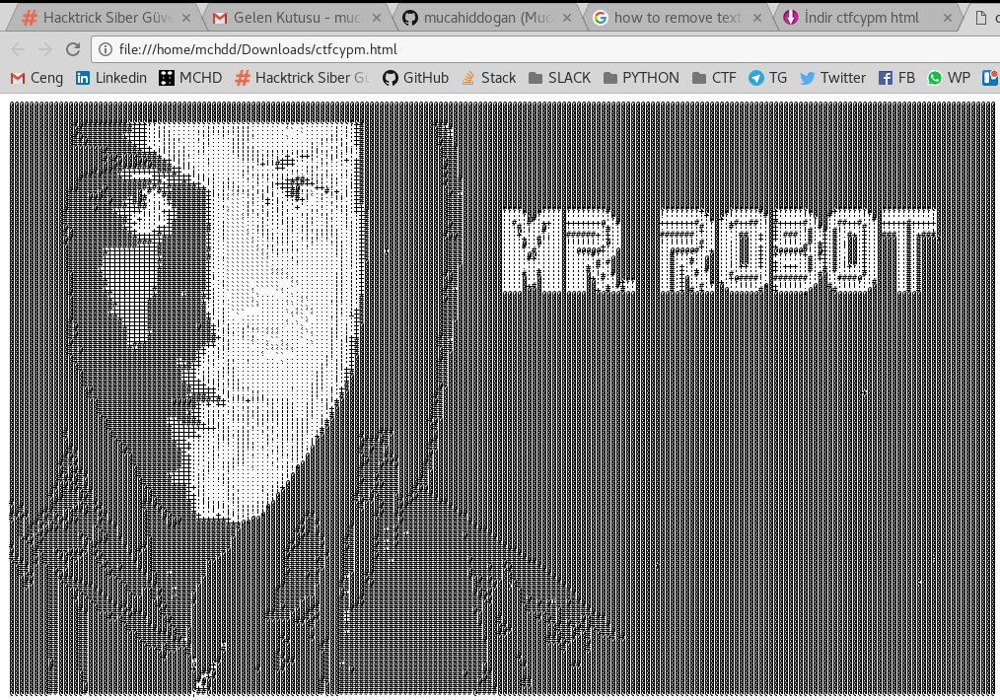
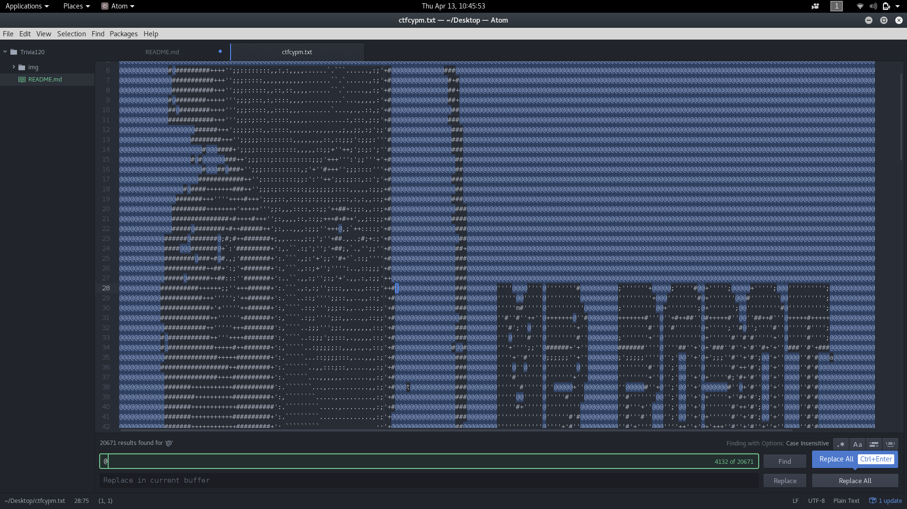
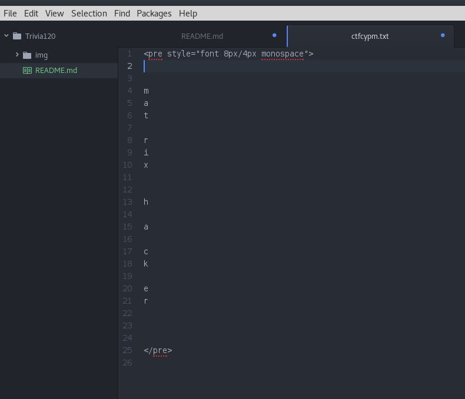

# Trivia120

# Mr. Robot

Soru linki: http://dosya.co/kdi5poggcvp3/ctfcypm.html.html

Bu linkte bir html dosyası dosya şu şekilde hazırlanmış.


Burada bazı karakterler ile oluşturulmuş Mr. Robot şeklini görüyoruz.
Karakterlerin arasına gizlenen şifreyi bulmak için ise karakterleri eleyen kod yazmak yerine
atom text editor de Ctrl+f ile Find and Replace özelliği kullanılabilir.



Find and Replace özelliği ile tekrar eden karakterleri

``` @ # : ; ' , . + ` ```

Replace kısmını boş bırakarak Replace all denilip asıl metin ortaya çıkarılabilir.



```
flag: cypwn_{matrixhacker}
```
